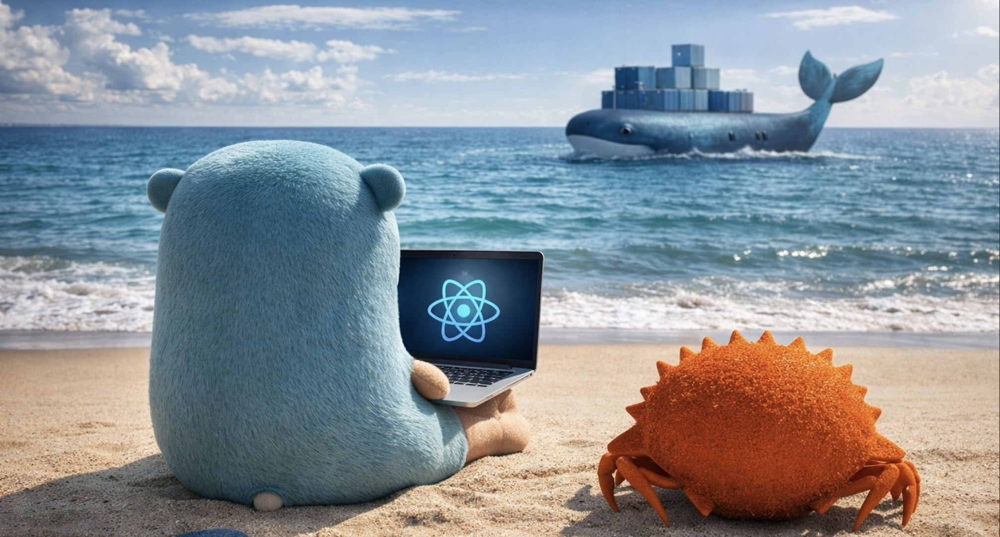

  

# Hola, soy Alejandro Astudillo 👋

### Ingeniero Civil Informático | Entusiasta de la IA y Arquitectura de Software

Soy un desarrollador apasionado por crear soluciones tecnológicas innovadoras y escalables.

Me especializo en el desarrollo de software robusto, con un fuerte enfoque en **Arquitectura de Software** e integración de **Modelos de Lenguaje (LLMs)**.

---

### 🚀 Sobre mí

- 🔭 Actualmente estoy trabajando en profundizar mis conocimientos en **Arquitectura Hexagonal** y **Cloud**.
- 💡 Me motiva: La transformación digital y el impacto de la IA en el desarrollo web.
- 🎓 **Educación:** Ingeniero Civil Informático - USM (2020-2025).

---

### 🛠️ Tech Stack

Mis herramientas favoritas y con las que tengo experiencia:

#### 💻 Lenguajes

#### 🌐 Frontend

#### ⚙️ Backend & API

#### 🗄️ Bases de Datos & Cloud

---

### 🧠 Inteligencia Artificial & Datos

Me apasiona el cruce entre la ingeniería de software tradicional y la IA moderna.

*   **LLMs:** Integración y uso de modelos de lenguaje.
*   **Data:** Procesamiento de datos con Python (NumPy).

---

### 💼 Experiencia Destacada

He trabajado en entornos corporativos reales asegurando calidad y seguridad:

*   **Banco Santander:** Migración de sistemas legacy (ASP a Angular) para el sitio privado del banco.
*   **Caja Los Andes (CCAF Chilena):** Optimización de seguridad (mitigación XSS), actualización de stack (Node 18->22) y migración de Front-end a Angular 18 con Material.

---

### 📫 Conectemos

Si te interesa conversar sobre **Frontend, Backend, Automatizaciones, Arquitectura de Software o IA**, ¡no dudes en contactarme!

